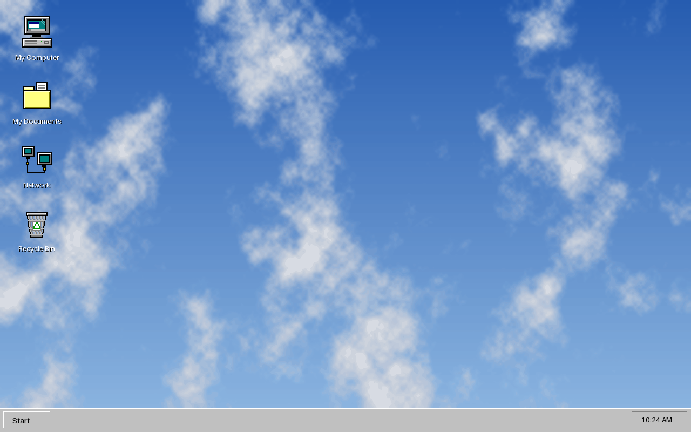

# Windows 98 for Windows 11 — Complete Edition

The **entire** Windows 98 experience on Windows 11 — taskbar, Start menu, wallpapers, screensaver, classic colors with navy title bars, desktop/folder/drive icons, cursors, event sounds, startup & shutdown music, lock screen — installed by **one double-click**, and removable by one double-click.

## Download

**[Windows98-Complete.zip](./Windows98-Complete.zip)** (~2 MB)

## Install

1. Right-click the zip → **Extract All** (running from inside the zip window won't work).
2. In the extracted folder, double-click **`INSTALL.bat`** — as your normal user, **not** "Run as administrator" (elevating the whole installer can apply settings to the wrong user profile).
3. Approve the single Administrator prompt that appears during step 3 of the install (it covers only the Start menu installer and lock screen — declining still installs everything else).

The installer copies the theme files directly into place (no reliance on the themepack handler), applies the theme, flips the color/sound switches Windows 11 hides from theme files, and downloads + installs + configures the classic shell (taskbar + Start menu). Internet is required for the shell downloads.

**Uninstall:** double-click `UNINSTALL.bat`. Every setting returns to the Windows 11 default; the shell apps are uninstalled.

## Complete coverage

| Windows 98 element | How it's delivered |
|---|---|
| **Taskbar** | [RetroBar](https://github.com/dremin/RetroBar) — pixel-accurate Windows 95/98 taskbar with working Start button, quick launch, tray and clock. Auto-downloaded from its official GitHub release, set to run at sign-in; the Windows 11 taskbar is auto-hidden behind it. |
| **Start menu** | [Open-Shell](https://github.com/Open-Shell/Open-Shell-Menu) — the classic cascading Start menu, auto-downloaded and preconfigured to the classic single-column style and skin. |
| **Window chrome & colors** | All 30 Windows 98 "Windows Standard" system colors + AeroLite visual style + accent-on-title-bars enabled — active windows get real navy caption bars, silver chrome, navy selection. |
| **Wallpapers** | "Clouds" (2560×1440, applied by default) plus Teal, Blue Rivets, Waves and Sandstone recreations, all installed locally. |
| **Screensaver** | Mystify (*Mystify Your Mind*) — the one actual Win98 screensaver still shipped in Windows 11 — enabled automatically. |
| **Desktop icons** | Pixel-art My Computer, My Documents, Network, Recycle Bin with auto-switching empty/full states. |
| **Explorer icons** | Classic yellow closed/open folders, 3.5″ floppy, hard drive, network drive and CD-ROM icons applied system-wide. |
| **Cursors** | The built-in classic scheme — original black arrow, hourglass-era pointers. |
| **Event sounds** | The authentic Win95/98-era WAVs still shipped in `C:\Windows\Media`: ding, chord, tada, chimes, notify, navigation click, recycle. |
| **Startup / shutdown music** | Bundled compositions play at sign-in and shutdown (Windows 11 removed native logon sounds; the installer wires them back via a per-user Run entry and a shutdown-event task). Own the Microsoft originals? Drop your WAVs over `Sounds\win98-startup.wav` / `win98-shutdown.wav` in the theme folder. |
| **Lock screen** | Clouds (with the Administrator prompt approved). |

Prefer only some pieces? The ZIP's `README.txt` documents the per-component scripts (`Windows98.themepack` alone, `Extras\Enable-Win98-Extras.bat`, `Extras\Install-Win98-Shell.ps1`).

## What it deliberately does NOT do

True 3D-beveled window borders require patching Windows' theme signature verification (UltraUXThemePatcher / SecureUXTheme) — that modifies protected system components, can break on every Windows update, and directly conflicts with keeping Windows 11 stable and fully functional. This package will not do that. AeroLite + navy caption bars is the maximum Windows 11 allows for window chrome without patching, and everything else on the list above is fully delivered.

## Safety & reversibility

- The theme is a standard Microsoft `.themepack`; visual style, screensaver and event sounds are stock Windows 11 files.
- RetroBar and Open-Shell are well-known, free, open-source projects, downloaded over HTTPS from their **official GitHub releases** — this package bundles no third-party binaries of its own.
- All scripts are short, commented, plain-text PowerShell — read them before running.
- Settings changes are per-user registry only. Windows Update, snap layouts, widgets, virtual desktops and every other Windows 11 feature keep working.
- `UNINSTALL.bat` restores all defaults and uninstalls the shell apps; the theme tile deletes from Settings → Themes.

## Files

`Windows98-Complete.zip` (everything) · `Windows98.themepack` (theme only) · `INSTALL.bat` / `UNINSTALL.bat` · `Windows98.theme` (definition source) · `DesktopBackground/` (5 wallpapers) · `Icons/` (10 icons) · `Sounds/` (startup/shutdown music) · `Extras/` (8 scripts) · `preview.png`
